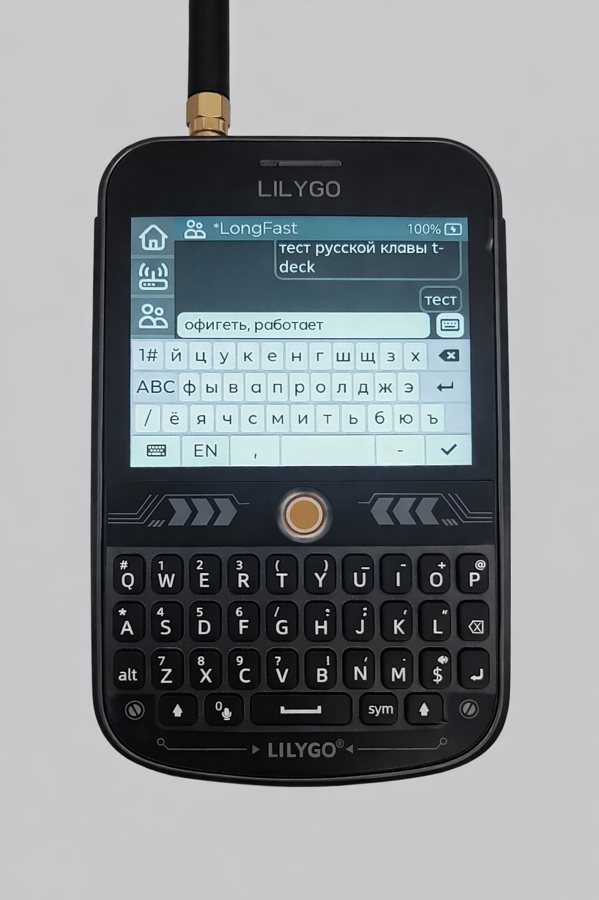

<div align="center" markdown="1">


<h1>Meshtastic Firmware (Russian Fork)</h1>

</div>

</div>

<div align="center">
	<a href="https://meshtastic.org">Website</a>
	-
	<a href="https://meshtastic.org/docs/">Documentation</a>
	-
	<a href="https://github.com/meshtastic/firmware">Upstream Repo</a>
</div>

## Overview

This is a fork of the [official Meshtastic firmware](https://github.com/meshtastic/firmware) with Russian language support. The fork is regularly synced with upstream and adds the following features:



### Russian Language Features

- **Russian OLED display** — Cyrillic text rendering on OLED screens (via `OLED_RU` build flag)
- **Russian keyboard for T-Deck** — Full Russian keyboard layout with EN/RU switching via the [device-ui fork](https://github.com/skrashevich/device-ui/tree/feat-russian-keyboard). Toggle layout by pressing **Left Shift + Mic button** simultaneously

### Supported Devices

| Device | Russian OLED | Russian Keyboard |
|--------|:---:|:---:|
| T-Deck (TFT) | ✅ | ✅ |
| Other devices with OLED | ✅ | — |

### Download

- 📦 **[Latest build artifacts](https://nightly.link/skrashevich/meshtastic-firmware/workflows/main_matrix/develop?preview)** — Pre-built firmware binaries from the `develop` branch

### Building

Follow the standard [Meshtastic build instructions](https://meshtastic.org/docs/development/firmware/build). To build the T-Deck firmware with Russian support:

```bash
pio run -e t-deck-tft
```

### Flashing

- ⚡ **[Flashing Instructions](https://meshtastic.org/docs/getting-started/flashing-firmware/)** – Install or update the firmware on your device.
